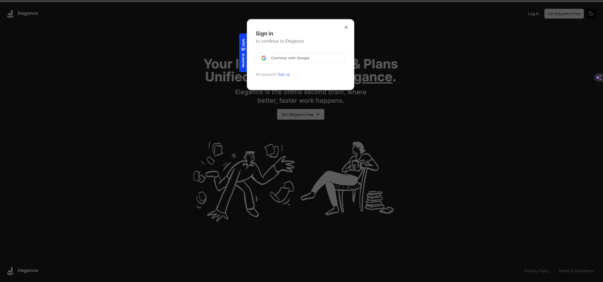
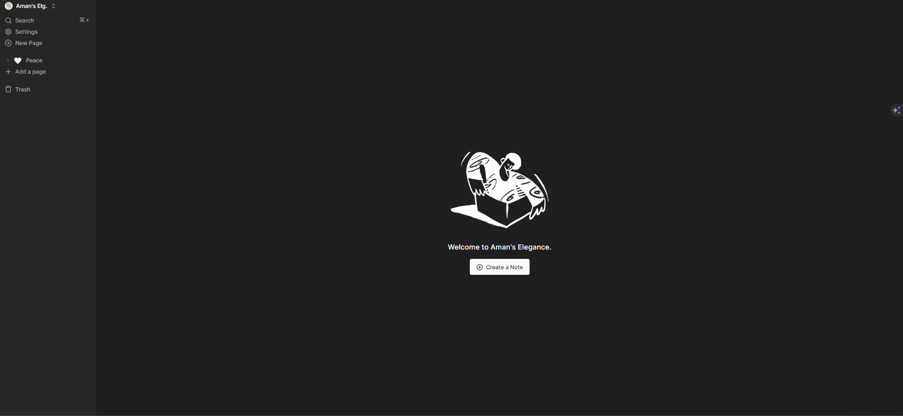
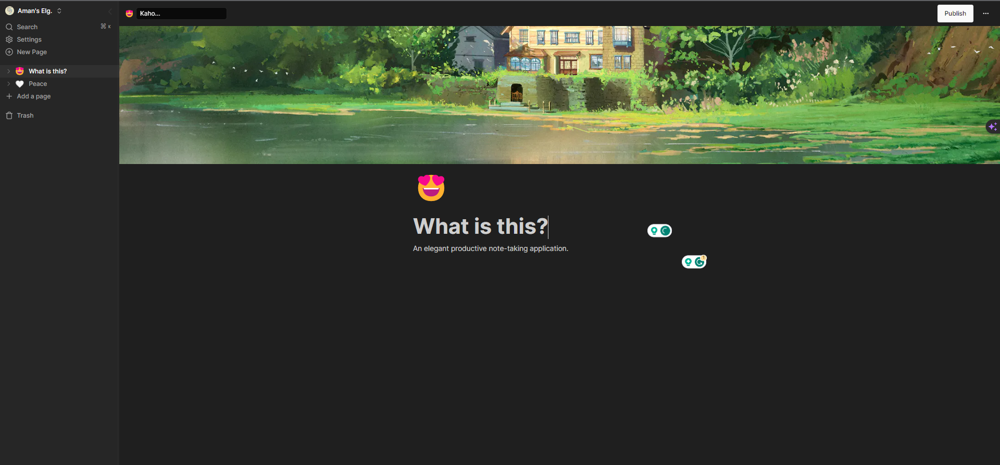
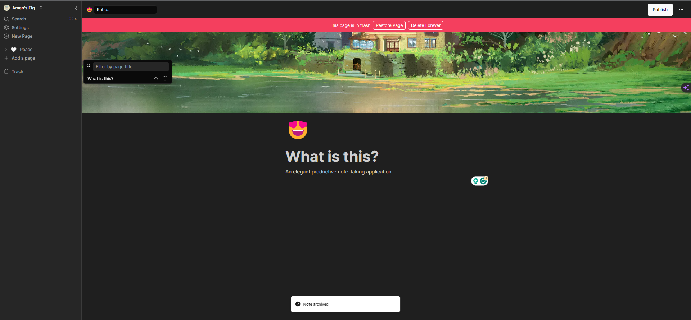
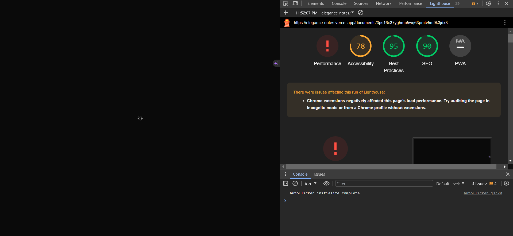

# Elegance - Productivity note taking application

## Tech Stack
* Next.js
* React.js
* TailwindCSS
* Clert for authentication
* Convex for the backend [convex](https://edgestore.dev/)
* For file store I used [edgestore](https://edgestore.dev/)
* Deployed [here](https://elegance-notes.vercel.app/)

## Key Features:

* Real-time database 🔗
* Notion-style editor 📝
* Light and Dark mode 🌓
* Infinite children documents 🌲
* Trash can & soft delete 🗑️
* Authentication 🔐
* File upload
* File deletion
* File replacement
* Icons for each document (changes in real-time) 🌠
* Expandable sidebar ➡️🔀⬅️
* Full mobile responsiveness 📱
* Publish your note to the web 🌐
* Fully collapsable sidebar ↕️
* Landing page 🛬
* Cover image of each document 🖼️
* Recover deleted files 🔄📄

# Markting Page

# Login and signup page using google through clerk.

# Home page

# Add icons, cover photo to the document

# Restore the delted notes

# Used best practices
